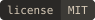
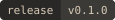
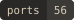
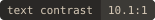
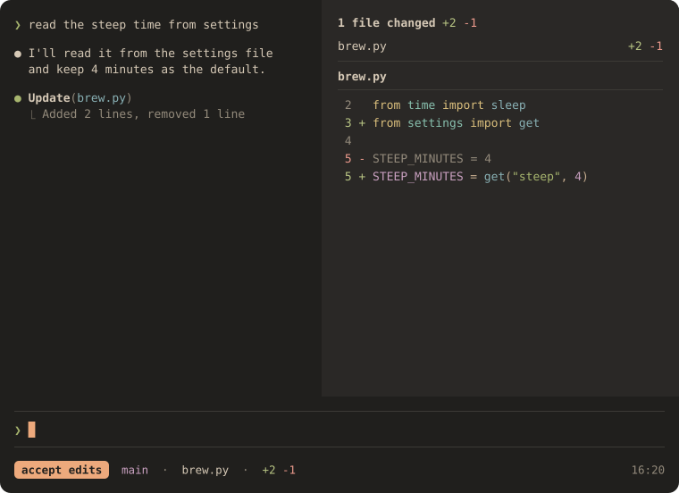
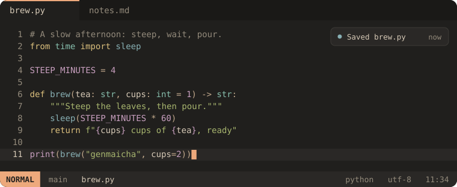
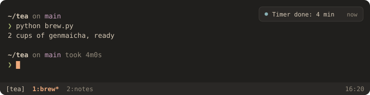
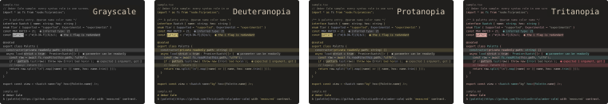

<div align="center">

# Umber Calm

A warm, low-glare dark palette with measured contrast.

[Palette](#palette) · [Install](#install) · [Ports](#ports) · [Design](#design)

   

<br><br>



</div>

## Why it exists

I made Umber Calm for my own eyes. I spend long days in terminals and editors, mostly on OLED screens. Most dark themes I tried felt loud to me there: bright white text on pure black, saturated blues, accents all competing for attention. So I started tuning my own.

On an OLED, pure black means the pixels switch off completely, so every bright letter sits on nothing at all. Umber Calm keeps the background a warm near-black and the text a warm off-white. The screen stays gently lit, and the contrast stays high without turning harsh.

I also wanted it to be less distracting. Color only shows up where it tells me something: a keyword, an error, or the one warm amber that marks where I am. Nothing is there just to decorate.

It began as a few colors in my dotfiles. I used them every day for months, on different machines and at different hours. Whenever something got in the way, I changed it. When I wasn't sure a color worked, I measured it instead of guessing.

What's left is the palette I want to look at all day. I'm sharing it in case it feels that way to you too. If it doesn't, the right palette is simply the one that's comfortable for you.

<hr>

<div align="center">
<details>
<summary><b>See everything at once</b><br><sub>an editor, a terminal, every syntax role and state, and color-vision renders</sub></summary>

<br>



<br><br>



<br><br>


<br><br>



<sub>The same code in grayscale and under three types of color-vision deficiency (Machado, Oliveira &amp; Fernandes, 2009). Details in [docs/color-vision.md](docs/color-vision.md).</sub>

</details>
</div>

<hr>

## Why it looks like this

- Warm near-black background (never pure black) and warm off-white text (never pure white).
- Main text at 10:1; accents between 6:1 and 9.3:1; every measured pair is enforced in CI.
- Categories are separated by hue while lightness stays in a narrow band.
- Red only means errors and deletions; amber only marks where you are.

## Palette

<!-- palette:begin -->
|  | Name | Hex | Contrast on `bg` | Used for |
|---|---|---|---|---|
|  | `bg` | `#201F1D` | — | Background |
|  | `bg_dim` | `#1A1917` | 1.1:1 | Chrome |
|  | `surface` | `#2A2826` | 1.1:1 | Panels |
|  | `overlay` | `#3C3A36` | 1.5:1 | Selection, strong borders |
|  | `inactive` | `#5A554E` | 2.2:1 | Borders |
|  | `dim_text` | `#6E6961` | 3.0:1 | Dim text |
|  | `muted` | `#938A7B` | 4.8:1 | Comments, secondary text, line numbers |
|  | `subtle` | `#C2A98C` | 7.3:1 | Operators |
|  | `text` | `#D6C9B6` | 10.1:1 | Variables, body text, current line number |
|  | `text_bright` | `#EDE3D2` | 13.0:1 | ANSI bright white |
|  | `red` | `#E08374` | 6.0:1 | Errors, deleted lines |
|  | `orange` | `#EDA97C` | 8.3:1 | Focus, cursor |
|  | `yellow` | `#DCC07D` | 9.3:1 | Keywords, preprocessor, headings, warnings, search |
|  | `green` | `#A7B56E` | 7.4:1 | Strings, inline code, success, added lines |
|  | `cyan` | `#88C0AE` | 8.0:1 | Types, namespaces, attributes, hints |
|  | `blue` | `#88B0B4` | 7.0:1 | Functions, tags, links, info, changed lines |
|  | `purple` | `#C9A0C0` | 7.3:1 | Escapes, constants, built-ins |
<!-- palette:end -->

## Install

**Neovim** (0.10 or newer, lazy.nvim):

```lua
{ "ChristianOrrala/umber-calm", lazy = false, priority = 1000, config = function() vim.cmd.colorscheme("umber-calm") end }
```

**VS Code:** download `umber-calm-<version>.vsix` from the [latest release](https://github.com/ChristianOrrala/umber-calm/releases/latest), run `code --install-extension umber-calm-<version>.vsix`, then pick *Umber Calm* with Cmd/Ctrl+K Cmd/Ctrl+T.

**A terminal (WezTerm):** copy [`ports/wezterm/umber-calm.toml`](ports/wezterm/umber-calm.toml) to `~/.config/wezterm/colors/` and set `config.color_scheme = 'Umber Calm'` in `wezterm.lua`.

**Everything else:** find your app in [Ports](#ports). Each port's README has install and uninstall steps, the version it was tested with, and its verification history.

## Ports

Umber Calm is in early development. Every port is generated from the app's documented format and every tier is downloadable; the tier says how far each one has been tested.

<!-- ports:begin -->
<details open>
<summary><b>✅ supported (7)</b>: tested in the real app, on the exact files</summary>

| App | Category | Download | Target version | Verified on | Notes |
|---|---|---|---|---|---|
| WezTerm | terminal | [ports/wezterm/](ports/wezterm/) | 20240203 | 20260901 · macOS 26.6.2 |  |
| tmux | multiplexer | [ports/tmux/](ports/tmux/) | 3.4 | 3.7 · macOS 26.6.2 |  |
| Zellij | multiplexer | [ports/zellij/](ports/zellij/) | 0.45.1 | 0.45.1 · macOS 26.6.2 |  |
| Starship | shell | [ports/starship/](ports/starship/) | 1.20 | 1.26.0 · macOS 26.6.2 |  |
| Neovim | editor | [ports/neovim/](ports/neovim/README.md) | 0.10 | 0.12.5 · macOS 26.6.2 |  |
| VS Code | editor | [ports/vscode/](ports/vscode/) | 1.95 (min 1.95.0) | 1.139.1 · macOS 26.6.2 |  |
| Claude Code | ai | [ports/claude-code/](ports/claude-code/) | 2.1.284 | 2.1.284 · macOS 26.6.2 |  |

</details>

<details>
<summary><b>🧪 experimental (42)</b>: format confirmed, not yet tested in the app</summary>

| App | Category | Download | Target version | Verified on | Notes |
|---|---|---|---|---|---|
| Alacritty | terminal | [ports/alacritty/](ports/alacritty/) | 0.14 | — |  |
| foot | terminal | [ports/foot/](ports/foot/) | 1.26.0 | — |  |
| Ghostty | terminal | [ports/ghostty/](ports/ghostty/) | 1.1 | — |  |
| GNOME Terminal | terminal | [ports/gnome-terminal/](ports/gnome-terminal/) | 3.54 | — |  |
| iTerm2 | terminal | [ports/iterm2/](ports/iterm2/) | 3.5 | — |  |
| Kitty | terminal | [ports/kitty/](ports/kitty/) | 0.39 | — |  |
| Konsole | terminal | [ports/konsole/](ports/konsole/) | 24.08 | — |  |
| Termux | terminal | [ports/termux/](ports/termux/) | 0.118 | — |  |
| Windows Terminal | terminal | [ports/windows-terminal/](ports/windows-terminal/) | 1.21 | — |  |
| Xfce Terminal | terminal | [ports/xfce4-terminal/](ports/xfce4-terminal/) | 1.1 | — |  |
| Xresources (xterm, urxvt; st with the xresources patch) | terminal | [ports/xresources/](ports/xresources/) | X11 | — |  |
| fish | shell | [ports/fish/](ports/fish/) | 3.7 | — |  |
| bat | cli | [ports/bat/](ports/bat/) | 0.24 | — |  |
| btop | cli | [ports/btop/](ports/btop/) | 1.4 | — |  |
| delta | cli | [ports/delta/](ports/delta/) | 0.18 | — |  |
| dircolors (ls) | cli | [ports/dircolors/](ports/dircolors/) | coreutils 9 | — |  |
| eza | cli | [ports/eza/](ports/eza/) | 0.19.2 | — |  |
| fzf | cli | [ports/fzf/](ports/fzf/) | 0.56 | — |  |
| lazygit | cli | [ports/lazygit/](ports/lazygit/) | 0.44 | — |  |
| yazi | cli | [ports/yazi/](ports/yazi/) | 25.5.28 | — |  |
| Helix | editor | [ports/helix/](ports/helix/) | 25.01 | — |  |
| JetBrains IDEs | editor | [ports/jetbrains/](ports/jetbrains/) | 2024.3 (min 2024.3) | — |  |
| Sublime Text | editor | [ports/sublime/](ports/sublime/) | 4192 | — |  |
| Vim | editor | [ports/vim/](ports/vim/README.md) | 9.1 | — |  |
| Zed | editor | [ports/zed/](ports/zed/) | 0.170 | — |  |
| dunst | desktop | [ports/dunst/](ports/dunst/) | 1.11 | — |  |
| fuzzel | desktop | [ports/fuzzel/](ports/fuzzel/) | 1.11 | — |  |
| GTK 3/4 + libadwaita | desktop | [ports/gtk/](ports/gtk/) | libadwaita 1.6 | — |  |
| i3 | desktop | [ports/i3/](ports/i3/) | 4.23 | — |  |
| KDE Plasma | desktop | [ports/kde/](ports/kde/) | 6.2 | — |  |
| rofi | desktop | [ports/rofi/](ports/rofi/) | 1.7 | — |  |
| sway | desktop | [ports/sway/](ports/sway/) | 1.10 | — |  |
| Waybar | desktop | [ports/waybar/](ports/waybar/) | 0.11 | — |  |
| zathura | desktop | [ports/zathura/](ports/zathura/) | 0.5 | — |  |
| Obsidian | app | [ports/obsidian/](ports/obsidian/) | 1.7 (min 1.7.0) | — |  |
| Slack | app | [ports/slack/](ports/slack/) | 4.41 | — |  |
| CSS variables | web | [ports/css/](ports/css/) | CSS | — |  |
| Firefox | web | [ports/firefox/](ports/firefox/) | 133 | — |  |
| Tailwind CSS v4 | web | [ports/tailwind/](ports/tailwind/) | 4.0 | — |  |
| aider | ai | [ports/aider/](ports/aider/) | 0.70 | — |  |
| Tinted Theming (base24) | scheme | [ports/base24/](ports/base24/) | base24 0.2 | — |  |
| JSON palette | data | [ports/json/](ports/json/) | schema 1 | — |  |

</details>

<details>
<summary><b>🟡 candidate (7)</b>: format not confirmed</summary>

| App | Category | Download | Target version | Verified on | Notes |
|---|---|---|---|---|---|
| Ptyxis | terminal | [ports/ptyxis/](ports/ptyxis/) | 47 | — | 🟡 The value syntax of .palette files could not be confirmed from official documentation. |
| qt5ct / qt6ct | desktop | [ports/qt5ct/](ports/qt5ct/) | qt6ct 0.9 | — | 🟡 The QPalette role order could not be confirmed from official documentation. |
| Discord | app | [ports/discord/](ports/discord/) | unpinned: needs the exact Vencord version or commit and the Discord Stable build it was tested on | — | 🟡 Not yet pinned to exact Vencord and Discord client versions. · ⚠️ requires a client mod (Vencord/BetterDiscord); client modifications are against Discord's Terms of Service |
| Spotify (Spicetify) | app | [ports/spotify/](ports/spotify/) | unpinned: needs the exact Spicetify version and the Spotify client version it was tested on | — | 🟡 Not yet pinned to exact Spicetify and Spotify client versions. · ⚠️ requires Spicetify, an unofficial Spotify client modification |
| Vimium | web | [ports/vimium/](ports/vimium/) | 2.1 | — | 🟡 The selectors follow community usage, not official documentation. |
| Vivaldi | web | [ports/vivaldi/](ports/vivaldi/) | 7.0 | — | 🟡 The value format of Vivaldi theme files could not be confirmed. |
| opencode | ai | [ports/opencode/](ports/opencode/) | 0.3 | — | 🟡 The value format of opencode theme files could not be confirmed. |

</details>
<!-- ports:end -->

## Verification

A tier is supported only while its last real-app test covers the exact files you download: changing any of them sends the port back to its untested tier. Each port's README keeps its full history.

<details>
<summary>Verification records for every port</summary>

<!-- verification:begin -->
| App | Tier | Last verified | App version | OS | Digest | Evidence |
|---|---|---|---|---|---|---|
| aider | 🧪 experimental | — |  |  | `b0c448ca3ff0` |  |
| Alacritty | 🧪 experimental | — |  |  | `a80cd10efbe6` |  |
| bat | 🧪 experimental | — |  |  | `2489c43a5701` |  |
| btop | 🧪 experimental | — |  |  | `3c5732c9c1c6` |  |
| Claude Code | ✅ supported | 2026-09-28 | 2.1.284 | macOS 26.6.2 | `69ea78169c34` |  |
| CSS variables | 🧪 experimental | — |  |  | `9ab8a88c7c9b` |  |
| delta | 🧪 experimental | — |  |  | `3308e3be3a24` |  |
| dircolors (ls) | 🧪 experimental | — |  |  | `83b2b3860ea3` |  |
| Discord | 🟡 candidate | — |  |  | `9dc2658db35c` |  |
| dunst | 🧪 experimental | — |  |  | `609fb82b5980` |  |
| eza | 🧪 experimental | — |  |  | `6059afb38427` |  |
| Firefox | 🧪 experimental | — |  |  | `e03e2678c5a4` |  |
| fish | 🧪 experimental | — |  |  | `c42a72950b4f` |  |
| foot | 🧪 experimental | — |  |  | `ecacdd9402bc` |  |
| fuzzel | 🧪 experimental | — |  |  | `3fe79bd2457d` |  |
| fzf | 🧪 experimental | — |  |  | `ae8fbdd67487` |  |
| Ghostty | 🧪 experimental | — |  |  | `3a140bb745a0` |  |
| GNOME Terminal | 🧪 experimental | — |  |  | `483e82f0dd6c` |  |
| GTK 3/4 + libadwaita | 🧪 experimental | — |  |  | `75042c4bc795` |  |
| Helix | 🧪 experimental | — |  |  | `fe1cda73f826` |  |
| i3 | 🧪 experimental | — |  |  | `993976e10b90` |  |
| iTerm2 | 🧪 experimental | — |  |  | `31d0cc69bd19` |  |
| JetBrains IDEs | 🧪 experimental | — |  |  | `860671984433` |  |
| JSON palette | 🧪 experimental | — |  |  | `16953139bba3` |  |
| KDE Plasma | 🧪 experimental | — |  |  | `92dd51c9508e` |  |
| Kitty | 🧪 experimental | — |  |  | `af11f9c1c9a3` |  |
| Konsole | 🧪 experimental | — |  |  | `6c43aa80731f` |  |
| lazygit | 🧪 experimental | — |  |  | `c915507922a2` |  |
| Neovim | ✅ supported | 2026-09-28 | 0.12.5 | macOS 26.6.2 | `8b91eb053607` |  |
| Obsidian | 🧪 experimental | — |  |  | `259357114b2f` |  |
| opencode | 🟡 candidate | — |  |  | `e4fc9ec9a42e` |  |
| Ptyxis | 🟡 candidate | — |  |  | `3c3ad48e75ae` |  |
| qt5ct / qt6ct | 🟡 candidate | — |  |  | `4ff58683ce80` |  |
| rofi | 🧪 experimental | — |  |  | `954a168da103` |  |
| Slack | 🧪 experimental | — |  |  | `aeb155227e30` |  |
| Spotify (Spicetify) | 🟡 candidate | — |  |  | `9d1d4e2ce7c9` |  |
| Starship | ✅ supported | 2026-09-28 | 1.26.0 | macOS 26.6.2 | `5a93696bbb6f` |  |
| Sublime Text | 🧪 experimental | — |  |  | `f5191beac8c7` |  |
| sway | 🧪 experimental | — |  |  | `6e2051171136` |  |
| Tailwind CSS v4 | 🧪 experimental | — |  |  | `98fa9d137e80` |  |
| Termux | 🧪 experimental | — |  |  | `d955f89d442b` |  |
| Tinted Theming (base24) | 🧪 experimental | — |  |  | `12b120d7e443` |  |
| tmux | ✅ supported | 2026-09-28 | 3.7 | macOS 26.6.2 | `dfae7360e1c4` |  |
| Vim | 🧪 experimental | — |  |  | `5e766e51c86d` |  |
| Vimium | 🟡 candidate | — |  |  | `02b715566580` |  |
| Vivaldi | 🟡 candidate | — |  |  | `d798edf8ec2e` |  |
| VS Code | ✅ supported | 2026-09-28 | 1.139.1 | macOS 26.6.2 | `0246d948acbe` |  |
| Waybar | 🧪 experimental | — |  |  | `52fb3b90c649` |  |
| WezTerm | ✅ supported | 2026-09-28 | 20260901 | macOS 26.6.2 | `2ef53e6927a3` |  |
| Windows Terminal | 🧪 experimental | — |  |  | `f21b0b6c213a` |  |
| Xfce Terminal | 🧪 experimental | — |  |  | `3a860d9ef4a6` |  |
| Xresources (xterm, urxvt; st with the xresources patch) | 🧪 experimental | — |  |  | `154baa7a9fb5` |  |
| yazi | 🧪 experimental | — |  |  | `ace28270c6bd` |  |
| zathura | 🧪 experimental | — |  |  | `a687ceefae88` |  |
| Zed | 🧪 experimental | — |  |  | `8489d64267b9` |  |
| Zellij | ✅ supported | 2026-09-28 | 0.45.1 | macOS 26.6.2 | `8ad27fb2e46e` |  |
<!-- verification:end -->

</details>

## Design

The background is a warm near-black rather than pure black, and text is a warm off-white rather than pure white, chosen to avoid the harsh edges of maximum contrast. Accents sit in a narrow lightness band so no category shouts over the others. No study of this palette exists; the numbers above are measurements, not promises.

More in [docs/design.md](docs/design.md), including renderings of the same code in grayscale and under three types of color-vision deficiency, and the full contracts in [docs/style-guide.md](docs/style-guide.md).

## Contributing

See [CONTRIBUTING.md](CONTRIBUTING.md). Verification reports from real apps are the most useful contribution.

## License

MIT — see [LICENSE](LICENSE).

## Acknowledgements

Inspired by the care in Gruvbox Material, Everforest and Kanagawa.
