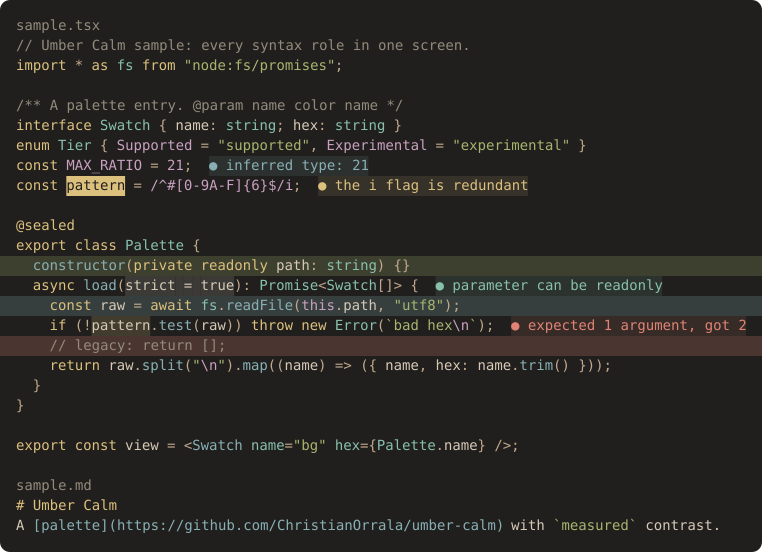

# Design

## Why this palette exists

I made Umber Calm for my own eyes. I spend long days in terminals and editors and wanted something that felt calmer to look at, so I tuned it over months of daily use and measured every choice along the way. It is shared in case it is useful to someone else. If it feels comfortable to you too, use it.

No study of this palette exists. What follows are the choices, the mechanism behind each one, and the measurements; none of it is a promise about how anyone's eyes will respond.

## Choices and the reasons behind them

- **Near-black, not black.** The background is `#201F1D`. Large brightness differences between neighboring areas make the eye re-adapt as the gaze moves; a background that is dark but not black keeps those jumps smaller, both between text and background and between the screen and a dim room. On the optical side, the pupil opens wider in the dark, and a wider pupil lets more of the eye's optical aberrations into the image (Campbell & Gubisch, 1966).
- **Off-white, not white.** Text is `#D6C9B6` at 10:1 against the background: well above the WCAG AAA level of 7:1 (W3C, 2023) and far below the 21:1 of pure white on pure black, where bright glyph edges tend to glow (halation).
- **Warm light.** Warm whites contain proportionally less short-wavelength light than cool whites of the same brightness, so the text, the background and even the "blue" accent sit on the warm side; the blue is a muted teal-slate.
- **Moderate chroma, even lightness.** Strongly saturated colors on a dark background can seem to shimmer at their edges. The accents keep moderate chroma and a narrow lightness band (7:1 to 9.3:1 on the background), so hue tells categories apart and no category is much louder than another. Separation is measured in OKLab (Ottosson, 2020); see [color-vision.md](color-vision.md).
- **Two reserved colors.** Red only marks errors and deletions. Amber only marks where you are: the cursor, the active tab, the focused pane.
- **Measured pairs.** Every measured pair — the base pairs and the closed set of states — is listed in the [style guide's measured readability table](style-guide.md#measured-readability) and enforced in CI. Colors an app composites itself, or picks on its own, are covered by verification instead.

## A note on dark themes

Studies of reading generally find dark text on a light background easier to read for most people (Piepenbrock, Mayr, Mund & Buchner, 2013). Umber Calm is for people who prefer a dark screen anyway; it tries to make that dark screen as even and unexciting as possible.

## Renderings

The same sample code in every simulation, generated from [`tests/fixtures/sample.spans.json`](../tests/fixtures/sample.spans.json) by `tools/build.py`:

[Grayscale](renders/grayscale.svg) · [Deuteranopia](renders/deuteranopia.svg) · [Protanopia](renders/protanopia.svg) · [Tritanopia](renders/tritanopia.svg) (Machado, Oliveira & Fernandes, 2009).

## Known trade-offs

- Close hue pairs: orange/yellow (ΔE_OK 6.2) and cyan/blue (ΔE_OK 4.9). With low chroma, even lightness and warm hues only, about five categories separate clearly; cyan and blue act as one "cool" family.
- Comments on panels are 4.3:1 (exception E1) because comments are meant to recede.
- Color-vision data for every accent pair is in [color-vision.md](color-vision.md).

## References

- Campbell, F. W., & Gubisch, R. W. (1966). Optical quality of the human eye. *The Journal of Physiology*, 186(3), 558–578.
- Machado, G. M., Oliveira, M. M., & Fernandes, L. A. F. (2009). A physiologically-based model for simulation of color vision deficiency. *IEEE Transactions on Visualization and Computer Graphics*, 15(6), 1291–1298.
- Ottosson, B. (2020). A perceptual color space for image processing. https://bottosson.github.io/posts/oklab/
- Piepenbrock, C., Mayr, S., Mund, I., & Buchner, A. (2013). Positive display polarity is advantageous for both younger and older adults. *Ergonomics*, 56(7), 1116–1124.
- W3C (2023). Web Content Accessibility Guidelines (WCAG) 2.2. https://www.w3.org/TR/WCAG22/
